# 面试准备

## 一、Redis

### 名词解释
```
CAP理论：一个分布式系统最多只能同时满足一致性（Consistency）、可用性（Availability）和分区容错性（Partition tolerance）这三项中的两项。
CP:高一致性  AP:高可用性
```

### 1.缓存穿透：
```
产生原因：指请求一个不存在的key,因redis查询不到，所以会直接查询Db
解决办法：查询为null的值也存入缓存，或使用布隆过滤器
注：布隆过滤器：设置一个初始值都为0的数组，数据过来后进行三次hash计算，把数组对应的下标数据改为1，存在误判的情况，可以设置误判率，一般小于5%
```


### 2.缓存击穿：
```
产生原因：指在key值过期的瞬间大量请求过来，会直接查询Db
解决办法：互斥锁或设置逻辑过期时间
注：互斥锁逻辑：1查询数据不存在→2获取互斥锁→3查询Db进行缓存重建→4写入缓存→5释放锁
其他线程在获取锁时失败，所以休眠一会再重试
逻辑过期：1查询数据发现已过期→2获取互斥锁→ 3开启新线程进行缓存重建（重建过程中重置过期时间）→ 4返回过期数据
```

### 3.缓存雪崩：
```
产生原因：指在同一时间大量key过期或redis服务器宕机
解决办法：1给不同的key的过期时间设置随机 值
   2利用redis集群提高服务可用性
   3给缓存业务添加降级限流策略nginx或gateway
   4给业务添加多级缓存
```


### 4.双写一致性（ MySQL的数剧如何与redis进行同步）
```
一致性高的解决办法：使用读写锁（共享锁及排他锁）类似 MySQL的共享锁和排他锁
读锁（get redlock）共享锁：允许同 读数据，但不允许写入数剧
写锁(get writelock)排他锁：不允 许读也不允许写，基于redission
强一致，性能低
允许延迟一致的解决办法：监听MySQL的 binlog日志来实现，监听insert和update操作
```

### 5.Redis持久化
```
RDB:数据备份文件，也叫redis数据快照。把内存中所有数据都记在磁盘中 ，当redis故障重启后，从磁盘读文件恢复数据
AOF:追加文件，redis处理的每一个写命令都会记录在AOF文件
```

### 6.Redis数据过期策略
```
惰性删除：查询时发现过期再删
定期删除：定期检查随机key,如果过期则删除（slow模式和fast模式）
SLOW模式是定时任务，执行频率可以通过修改配置文件redis.conf 来调整。
FAST模式执行频率不固定，但两次间隔不低于2ms，每次耗时不超过1ms。
两种配合使用
```
### 7.数据删除策略
```
Noeviction:默认不删除，但内存满了不允许写
Volatile-ttl:比较有过期时间的key,先删除小的
Allkeys-random:对全体key随机淘汰
Volatile-random:对设置了过期时间的key随机淘汰
Allkeys-lru:对全体key进行lru算法淘汰（lru最近最少使用）--->常用
Volatile-lru: 对设置了过期时间的key lru算法淘汰
Allkeys_lfu：对全体key进行lfu算法淘汰（lfu最少频率使用）
Volatile-lfu: 对设置了过期时间的key lfu算法淘汰
```
### 8.Redis的分布式锁
```
利用Redis的单线程特性，在多个Redis客户端同时通过SETNX命令尝试获取锁，如果返回1表示获取锁成功，否则表示获取锁失败。
因为Redis的单线程机制，所以可以保证只会有一个客户端成功获取到锁，而其他客户端则会失败。如果获取锁成功，则设置一个过期时间，防止该客户端挂了之后一直持有该锁。客户端释放锁的时候，需要先判断该锁是否仍然属于该客户端，如果是，则通过DEL命令释放锁。

缺点：
1、锁无法续期
2、无法避免死锁
3、存在竞争，影响效率
4、不可重入
```

### 9.基于Redission实现分布式锁
```
优点：
是一个可以续期的可重入锁，并引入看门狗机制，对锁自动续期。
看门狗：新启一个线程监听业务是否执行完毕，未执行完毕，自动进行续期（每10s），其他线程会在规定的时间内自旋等待，超时抛出异常
```

### 10.红锁（ReadLock）
```
问题产生原因：
1、在使用单节点Redis实现分布式锁时，如果这个Redis实例挂掉，那么所有使用这个实例的客户端都会出现无法获取锁的情况。
2、当使用集群模式部署的时候，如果master一个客户端在master节点加锁成功了，然后没来得及同步数据到其他节点上，他就挂了， 那么这时候如果选出一个新的节点，再有客户端来加锁的时候，就也能加锁成功，因为数据没来得及同步，新的master会认为这个key是不存在的。
解决办法：
RedLock是通过引入多个Redis节点来解决单点故障的问题。
在进行加锁操作时，RedLock会向每个Redis节点发送相同的命令请求，每个节点都会去竞争锁，如果至少在大多数节点上成功获取了锁，那么就认为加锁成功。反之，如果大多数节点上没有成功获取锁，则加锁失败。这样就可以避免因为某个Redis节点故障导致加锁失败的情况发生。
举例说明：
1、客户端想要获取锁时，会生成一个全局唯一的ID（官方文档建议使用系统时间来生成这个ID）
2、客户端尝试使用这个ID获取所有redis节点的同意，这一步通过使用SETNX命令实现。
3、如果有半数以上的节点同意，那么锁就被成功设置了。
4、获取锁之后，用户可以执行想要的操作。
5、最后，不想用这把锁的时候，再尝试依次解锁，无论锁是否成功获取。

如果主节点宕机，会从有锁的单节点中随机找一台升级成主节点
```

### 11.Redis的脑裂问题
```
问题产生原因
所谓脑裂，就像他的名字一样，大脑裂开了，一般来说就是指一个分布式系统中有两个子集，然后每个子集都有一个自己的大脑(Leader/Master)。那么整个分布式系统中就会存在多个大脑了，而且每个自己都认为自己是正常的，从而导致数据不一致或重复写入等问题。

1、网络分区导致脑裂：
Master节点，哨兵和Slave节点被分割为了两个网络，Master处在一个网络中，Slave库和哨兵在另外一个网络中，此时哨兵发现和Master连不上了，就会发起主从切换，选一个新的Master，这时候就会出现两个主节点的情况。
2、主从节点导致脑裂
Master节点有问题，哨兵就会开始选举新的主节点，但是在这个过程中，原来的那个Master节点又恢复了，这时候就可能会导致一部分Slave节点认为他是Master节点，而另一部分Slave新选出了一个Master

脑裂会导致1、数据不一致；2、重复写入；3、数据丢失

解决办法：
1、min-slaves-to-write：：主库能进行数据同步的最少从库数量；
2、min-slaves-max-lag：：主从库间进行数据复制时，从库给主库发送 ACK 消息的最大延迟秒数。
必须同事满足，否则拒绝写入
```

### 12.Redis和Lua脚本的区别
```
但是，Redis的事务在执行过程中，如果有某一个命令失败了，是不影响后续命令的执行的，而Lua脚本中，如果执行过程中某个命令执行失败了，是会影响后续命令执行的。
1、交互次数：Redis每次提交一条命令都会进行一次网络交互，先暂存，后执行；Lua只会进行一次网络交互
2、前后依赖：Redis每条命令都是独立的，不会互相依赖；Lua脚本可以根据前一条脚本的执行结果执行
3、流程编排：Lua可以进行复杂的流程编排
```

### 13.分布式锁的lock方法和tryLock方法的区别
```
tryLock是尝试获取锁，如果能获取到直接返回true，如果无法获取到锁，他会按照我们指定的waitTime进行阻塞，在这个时间段内他还会再尝试获取锁。如果超过这个时间还没获取到则返回false。如果我们没有指定waitTime，那么他就在未获取到锁的时候，就直接返回false了。
lock的原理是以阻塞的方式去获取锁，如果获取锁失败会一直等待，直到获取成功。
所以，我们可以认为，lock实现的是一个阻塞锁，而tryLock实现的是一个非阻塞锁（在没有指定waitTime的情况下）。
```

### 14.集群模式
```
Redis有三种主要的集群模式，用于在分布式环境中实现高可用性和数据复制。这些集群模式分别是：主从复制（Master-Slave Replication）、哨兵模式（Sentinel）和Redis Cluster模式。
1、主从复制：主从模式中，包括一个主节点（Master）和一个或多个从节点（Slave）。主节点负责处理所有写操作和读操作，而从节点则复制主节点的数据，并且只能处理读操作。当主节点发生故障时，可以将一个从节点升级为主节点，实现故障转移（需要手动实现）。
2、哨兵模式：哨兵模式是在主从复制的基础上加入了哨兵节点。哨兵节点是一种特殊的Redis节点，用于监控主节点和从节点的状态。当主节点发生故障时，哨兵节点可以自动进行故障转移，选择一个合适的从节点升级为主节点，并通知其他从节点和应用程序进行更新。
3、Redis Cluster模式：Redis Cluster是Redis中推荐的分布式集群解决方案。它将数据自动分片到多个节点上，每个节点负责一部分数据。 
```

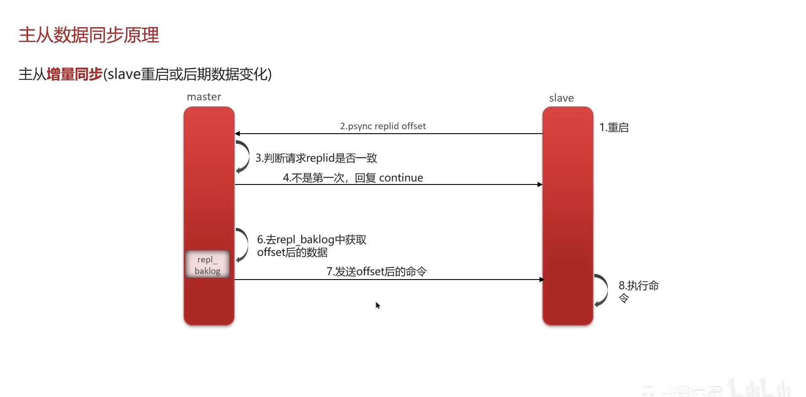

### 15.Redis为什么这么快
```
1、基于内存操作
2、单线程模型
3、多路复用I/O模型
4、高效的数据结构
5、多线程的引入
```
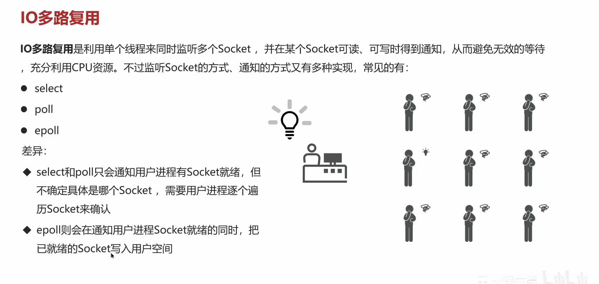
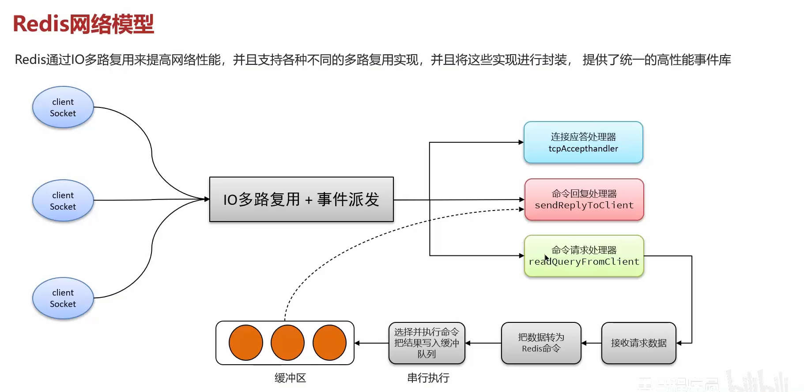
### 16.Redis中Zset的实现
```
Redis中的ZSet在实现中，有多种结构，大类的话有两种，分别是ziplist(压缩列表)和skiplist(跳跃表)，但是这只是以前，在Redis 5.0中新增了一个listpack（紧凑列表）的数据结构，这种数据结构就是为了替代ziplist的，而在之后Redis 7.0的发布中，在Zset的实现中，已经彻底不在使用zipList了。
zipList（ListPack）转换为SkipList条件：总的来说就是，当元素数量少于128，每个元素的长度都小于64字节的时候，使用ZipList（ListPack），否则，使用SkipList！
```


## 二、MySql

### 1.定位慢查询
```
1、介绍当时生产出现的问题
2、使用运维工具检测哪个接口耗时比较长，最终定位到sql
3、在mysql中开启了慢日志查询。设置阈值为2s，一旦sql执行超过2s就会被记录
```

### 2.分析慢sql
```
sql执行计划：找到慢的原因
采用explain或desc命令获取mysql如何执行select语句的信息
possible_key:sql可能使用到的索引
key:sql命中的索引
key_len:使用的索引占用的大小
Extra:额外的优化建议  关键看是否需要回表查询数据
type:sql的链接类型，性能由好到差为null system const eq_ref ref range index all
如果是index和all需要进行sql优化了
```
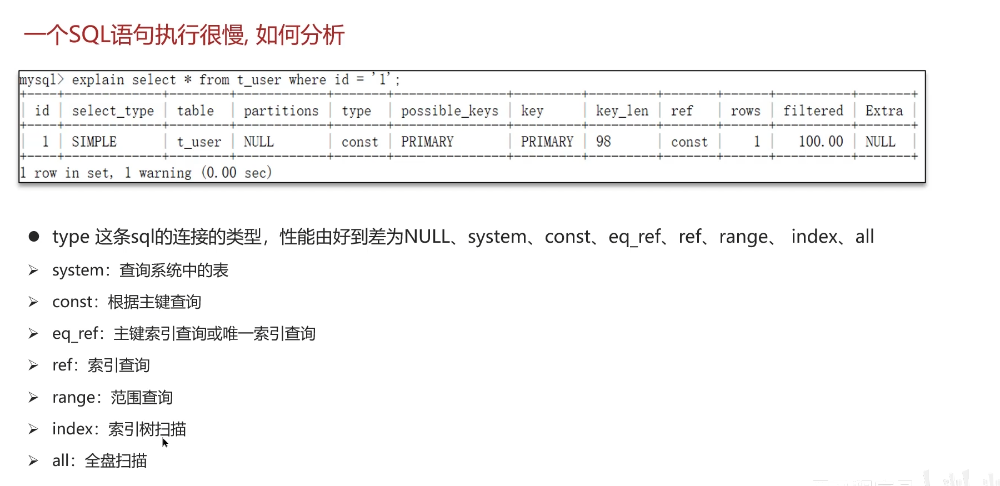

### 3.索引概念及底层数据结构
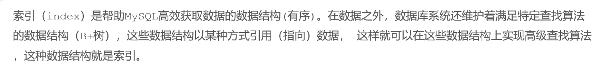
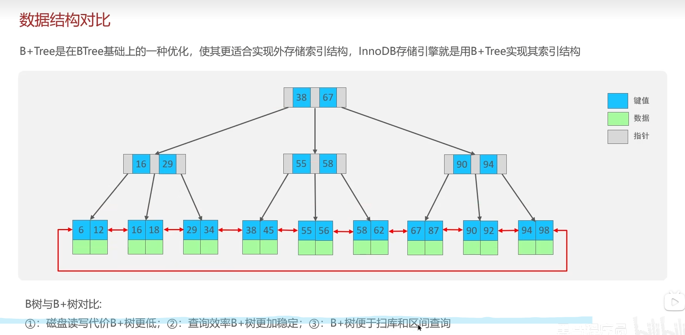

### 4.InnoDB和MyISAM的区别
```
1、InnoDB支持事务，，MyISAM不支持
2、InnoDB 是聚集索引，，MyISAM 是非聚集索引。MyISAM是采用了一种索引和数据分离的存储方式，Innodb的聚簇索引中索引和数据在一起
3、InnoDB支持外键，，MyISAM不支持
4、InnoDB 最小的锁粒度是行锁，，MyISAM 最小的锁粒度是表锁
5、InnoDB不支持FULLTEXT类型的索引（5.6之前不支持全文索引）
6、InnoDB中不保存表的行数，，但是MyISAM只要简单的读出保存好的行数即可
7、对于自增长的字段，InnoDB中必须包含只有该字段的索引，但是在MyISAM表中可以和其他字段一起建立联合索引
8、清空整个表时，InnoDB是一行一行的删除，效率非常慢。MyISAM则会重建表
```

### 5.char和varchar的区别
```
char是一种定长的数据类型，它的长度固定且在存储时会自动在结尾添加空格来将字符串填满指定的长度。char的长度范围是0-255
varchar是一种可变长度的数据类型，它只会存储实际的字符串内容，不会填充空格。因此，在存储短字符串时，varchar可以节省空间。varchar的长度范围是0-65535（MySQL 5.0.3之后的版本）。
所以char适合用来存储定长字段，如身份证号、手机号等
varchar适合用来存储变长字段，如地址、简介、评论等
```

### 6.数据库三范式
```
第一范式（1NF）是说，数据库表中的属性的原子性的，要求属性具有原子性，不可再被拆分；
第二范式（2NF）是说，数据库表中的每个实例或记录必须可以被唯一地区分，说白了就是要有主键，其他的字段都依赖于主键；
第三范式（3NF）是说，任何非主属性不依赖于其它非主属性，也就是说，非主键外的所有字段必须互不依赖。
```

### 7.数据库事务
```
原子性（Atomicity）：事务作为一个整体被执行，包含在其中的对数据库的操作要么全部被执行，要么都不执行。
一致性（Consistency）：事务应确保数据库的状态从一个一致状态转变为另一个一致状态。一致状态的含义是数据库中的数据应满足完整性约束。
隔离性（Isolation）：多个事务并发执行时，一个事务的执行不应影响其他事务的执行。
持久性（Durability）：一个事务一旦提交，他对数据库的修改应该永久保存在数据库中。
```

### 8.InnoDB一次更新事务具体流程
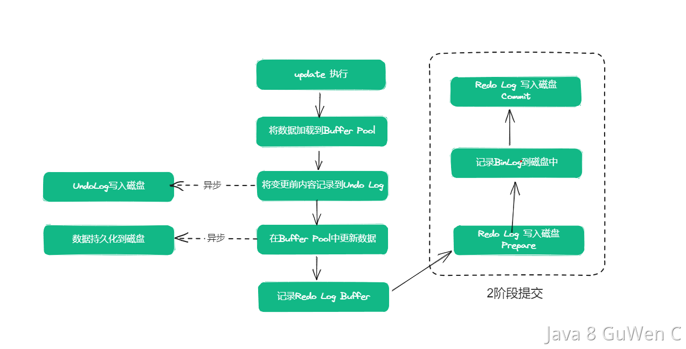

### 9.脏读、幻读、不可重复读
```
脏读：读到了其他事务还没有提交的数据。
不可重复读：对某数据进行读取过程中，有其他事务对数据进行了修改（UPDATE、DELETE)，导致第二次读取的结果不同。 
幻读：事务在做范围查询过程中，有另外一个事务对范围内新增了记录(INSERT)，导致范围查询的结果条数不一致。
```

### 10.事务的隔离级别
```
未提交读(Read uncommitted)：是最低的隔离级别。通过名字我们就可以知道，在这种事务隔离级别下，一个事务可以读到另外一个事务未提交的数据。这种隔离级别下会存在幻读、不可重复读和脏读的问题。
提交读(Read committed)：也可以翻译成读已提交，通过名字也可以分析出，在一个事务修改数据过程中，如果事务还没提交，其他事务不能读该数据。所以，这种隔离级别是可以避免脏读的发生的。
可重复读(Repeatable reads)：由于提交读隔离级别会产生不可重复读的读现象。所以，比提交读更高一个级别的隔离级别就可以解决不可重复读的问题。这种隔离级别就叫可重复读。但是这种隔离级别没办法彻底解决幻读。
可串行化(Serializable)：是最高的隔离级别，前面提到的所有的隔离级别都无法解决的幻读，在可串行化的隔离级别中可以解决。
```

### 11.Mysql的主从复制
```
MySQL在主从复制的过程中，数据的同步是通过bin log进行的，简单理解就是主服务器把数据变更记录到bin log中，然后再把bin log同步传输给从服务器，从服务器接收到bin log之后，再把其中的数据恢复到自己的数据库存储中。
binlog有三种格式，分别为：
statement：当binlog的格式为statement时，binlog 里面记录的就是 SQL 语句的原文，也就是说在数据库中执行的SQL会原封不动的记录到binlog中。
row：在ROW格式中，bin log会记录每个数据更改的具体行的细节。这意味着二进制日志中的每个条目都会详细列出发生变更的行的内容和修改。
mixed：这种其实就是把statement和row结合了，MySQL会根据SQL的情况，自动在row和statement中互相切换选择一个他认为合适的格式进行记录。
```

### 12.Mysql的乐观锁与悲观锁
```
悲观锁：先加锁再进行修改（select for update）
乐观锁：根据查询出的条件进行数据修改（查出数量为3的数据，修改时以改结果为条件进行修改）

1、乐观锁并未真正加锁，效率高。适用于读操作频繁，写操作相对较少的场景。一旦锁的粒度掌握不好，更新失败的概率就会比较高，容易发生业务失败。 
2、悲观锁依赖数据库锁，效率低。更新失败的概率比较低。适用于写操作较为频繁，且并发写入的概率较高的场景。
```

### 13.聚簇索引和非聚簇索引
```
数据库中的B+树索引分为聚集索引和非聚集索引。
聚集索引就是按照每张表的主键构造一个B+树，B+树的叶子节点中记录着表中一行记录的所有值。只要找到这个叶子节点也就得到了这条记录的所有值。（主键索引）
非聚簇索引的叶节点中不包含行记录的所有值。只包含索引值和主键的值。(不是主键的唯一索引)
所以非聚簇索引需要回表查询
主键索引不允许为null，但是唯一索引可以为null
```

### 14.binlog、redolog和undolog区别
```
binlog主要用来对数据库进行数据备份、崩溃恢复和数据复制等操作，redo log和undo log主要用于事务管理，记录的是数据修改操作和回滚操作。redolog用来做恢复，undolog用来做回滚。
```

### 15.索引覆盖和索引下推
```
覆盖索引（covering index）指一个查询语句的执行只用从索引中就能够取得，不必从数据表中读取。也可以称之为实现了索引覆盖。 (查询时只查询索引列就是索引覆盖)
索引下推：（针对联合索引）：
例子：people表中（zipcode，lastname，firstname）构成一个索引，执行SELECT * FROM people WHERE zipcode=’95054′ AND lastname LIKE ‘%etrunia%’ AND address LIKE ‘%Main Street%’;
如果没有使用索引下推技术，则MySQL会通过zipcode=’95054’从存储引擎中查询对应的数据，返回到MySQL服务端，然后MySQL服务端基于lastname LIKE ‘%etrunia%’和address LIKE ‘%Main Street%’来判断数据是否符合条件。 
如果使用了索引下推技术，则MYSQL首先会返回符合zipcode=’95054’的索引，然后根据lastname LIKE ‘%etrunia%’来判断索引是否符合条件。
就是如果没使用索引下推技术，会多进行一次回表查询，返回客户端数据，如果使用了索引下推技术，则会先返回索引，然后再继续查询后续索引是否符合条件，不用回表
```

### 16.索引失效情况
```
1、索引列参与计算 例：select * from mytable where age +1 = 12;
2、对索引列进行函数操作 例如：SELECT * FROM mytable WHERE YEAR(create_time) = 2022;
3、使用OR：如果使用OR的话，并且OR的两边存在<或者>的时候，就会索引失效，如：SELECT * FROM mytable WHERE name = 'Hollis' OR age > 18;
4、like操作：例如：SELECT * FROM mytable WHERE nick like '%Hollis';     
5、隐式类型转换：name是一个varchar类型，但是我们用int类型查询，这种是会导致索引失效的。例如：select * from mytable where name = 1;  
6、不等于比较：例如：SELECT * FROM mytable WHERE age != 18;
7、is not null：例如：SELECT * FROM mytable WHERE name is not null
8、order by：例如：SELECT * FROM mytable order by age
9、in：使用in的时候，有可能走索引，也有可能不走，一般在in中的值比较少的时候可能会走索引优化，但是如果选项比较多的时候，可能会不走索引：                                                                                                      
```

### 17.数据库的主从复制过程
```
1、从服务器在开启主从复制后，会创建出两个线程：I/O线程和SQL线程
2、从服务器的I/O线程，会尝试和主服务器建立连接，相对应的，主服务中也有一个binlog dump线程， 是专门来和从服务器的I/O线程做交互的。
3、从服务器的I/O线程会告诉主服务的dump线程自己要从什么位置开始接收binlog
4、主服务器在更新过程中，将更改记录保存到自己的binlog中，根据不同的binlog格式，记录的内容可能不一样。
5、在dump线程检测到binlog变化时，会从指定位置开始读取内容，然后会被slave的I/O线程把他拉取过去。(从服务器向主服务器发送请求拉去binlog日志文件)
6、从服务器的I/O线程接收到通知事件后，会把内容保存在relay log中。
7、从服务器还有一个SQL线程，他会不断地读取他自己的relay log中的内容，把他解析成具体的操作，然后写入到自己的数据表中。
```

### 18.主从复制方式
```
异步复制:这是MySQL默认的复制方式，在异步复制的方式中主库在执行完事务操作以后，会立刻给客户端返回。他不需要关心从库是否完成该事务的执行。
全同步复制:全同步复制的这个方式中，当主库执行完一个事务之后，他会等待所有的从库完成数据复制之后，才会给客户端反馈。
半同步复制:半同步复制是介于全同步复制和异步复制之间的一种方案。他再执行完一个事务之后，也不会立刻给客户端反馈，但是也不会等所有从库都完成事务，而是等其中一个从库完成接收到事件之后，再反馈给客户端。
```

## 三、框架
### 1.事务失效的场景
```
1、异常捕获处理
解决办法：在catch中抛出异常，事务可以正常执行
2、抛出检查异常
解决办法：@Transactional(rollbackFor = Exception.class)
3、非public方法
4、同一个类中调用自己的方法（无法实现代理）
5、final、static方法
6、事务中使用了多线程（基于ThreadLocal实现事务处理机制，新线程的操作不会被包含在原有的事务中）
```

### 2.spring的bean的生命周期
```
BeanDefintion
spring容器在实例化时，会将xml配置的<bean>的信息封装成一个BeanDefintion对象，spring根据BeanDefintion来创建Bean对象，里面有很多的属性来描述Bean信息
1、根据BeanDefintion实例化Bean对象
1步属于Bean创建
2、依赖注入（如@Autowired、@Value属性）
3、Aware接口（BeanNameAware、BeanFactoryAware、ApplicationContextAware）
4、BeanPostProcessor#befor（后置处理器，增强Bean的功能，Bean的初始化方法前调用）
5、初始化方法（InitializingBean，自定义init方法）
6、BeanPostProcessor#after（后置处理器，增强Bean的功能，Bean的初始化方法后调用）
2-6步属于初始化赋值操作，这个时候就可以使用Bean了
7、销毁Bean
```

### 3.spring中的循环引用（Bean的循环依赖）
```
1、循环引用是指多个Bean循环引用或者引用自己
```
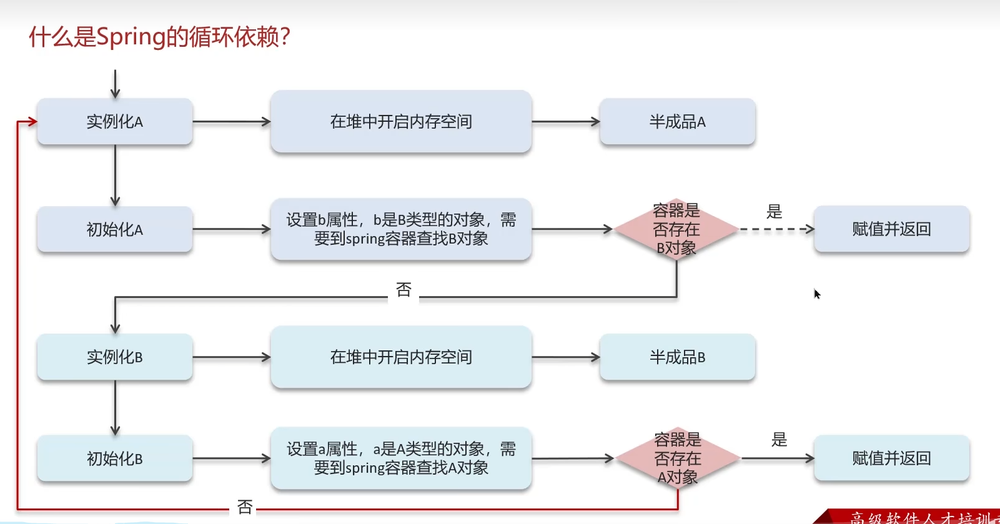

### 4.spring中的三级缓存
```
singletonObjects是一级缓存，存储的是完整创建好的单例bean对象。
earlySingletonObjects是二级缓存，存储的是尚未完全创建好的单例bean对象。
singletonFactories是三级缓存，存储的是单例bean的创建工厂。
```
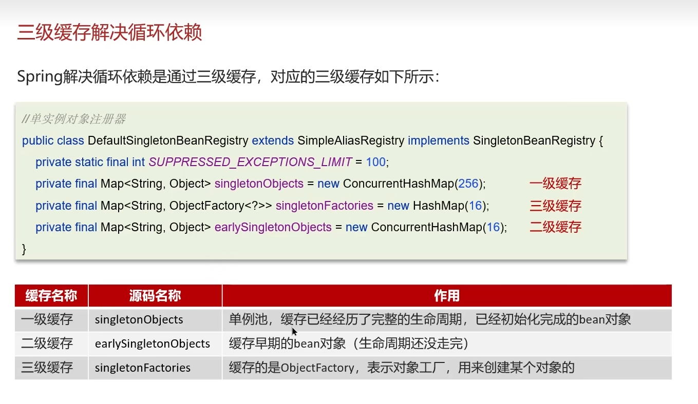

### 5.BeanFactory和Factory的关系
```
相同点：
1、两个都是接口
2、都是在org.springframework.beans.factory包下面
不同点：
1、BeanFactory是springIOC容器的一部分，负责管理Bean的依赖注入和生命周期
2、FactoryBean通常用于创建很复杂的对象，比如需要通过某种特定的创建过程才能得到的对象。例如，创建与JNDI资源的连接或与代理对象的创建。就如我们的Dubbo中的ReferenceBean。
```

### 6.springMVC的执行流程
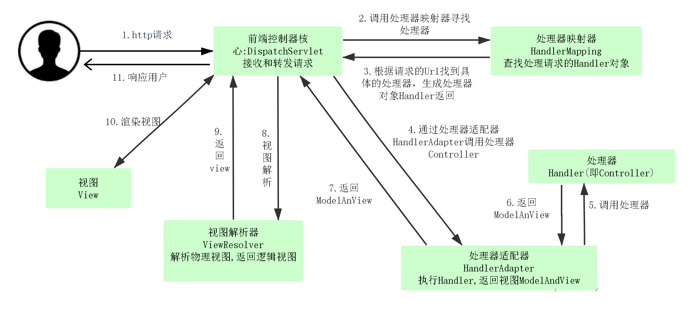

### 7.@SpringBootApplication
```
它主要包含@SpringBootConfiguration、@EnableAutoConfiguration等几个注解。也就是说可以直接在启动类中使用这些注解来代替@SpringBootApplication注解。 
关于Spring Boot中的Spring自动化配置主要是@EnableAutoConfiguration的功劳。该注解可以让Spring Boot根据类路径中的jar包依赖为当前项目进行自动配置。
@EnableAutoConfiguration中引入了一个@Import注解，注解中又引入了@EnableAutoConfigurationImportSelector注解，可以读取spring.factories中的key为
org.springframework.boot.autoconfigure.EnableAutoConfiguration中的值
@EnableAutoConfiguration中配置了多个类，每个Configuration都定义了Bean的实例化配置。
Bean初始化的具体实现通过@ConditionalOnProperty和@ConditionalOnMissingBean来实现。只有满足这种条件的时候，对应的bean才会被创建。
这样做的好处是什么？这样可以保证某些bean在没满足特定条件的情况下就可以不必初始化，避免在bean初始化过程中由于条件不足，导致应用启动失败。
```

### 8.springboot的启动流程
```
1、new SpringApplication的初始化过程
    1.添加源：将提供的源（通常是配置类）添加到应用的源列表中。
    2.设置 Web 环境：判断应用是否应该运行在 Web 环境中，这会影响后续的 Web 相关配置。
    3.加载初始化容器（启动核心）：从spring.factories文件中加载所有列出的ApplicationContextInitializer实现，
        并将他们设置到SpringApplication实例中，以便在应用上下文的初始化阶段执行他们
    4.设置监听器：加载和设置ApplicationListener实例，以便能够响应不同的事件
    5.确定主应用类：确定主应用类，这个主应用程序类通常是包含public static void main(String[] args)方法的类，是启动这个Spring boot应用的入口
2、SpringApplication.run的启动过程(比较主要的)
    1.启动&停止计时器：在代码中，用到stopWatch来进行计时。所以在最开始先要启动计时，在最后要停止计时。这个计时就是最终用来统计启动过程的时长的
    2.获取和启动监听器：这一步从spring.factories中解析初始所有的SpringApplicationRunListener 实例，并通知他们应用的启动过程已经开始。
    3.装配环境参数：这一步主要是用来做参数绑定的，prepareEnvironment 方法会加载应用的外部配置。这包括 application.properties 或 application.yml 文件中的属性，环境变量，系统属性等。所以，我们自定义的那些参数就是在这一步被绑定的。
    4.打印Banner：这一步的作用很简单，就是在控制台打印应用的启动横幅Banner。
    5.创建应用上下文：到这一步就真的开始启动了，第一步就是先要创建一个Spring的上下文出来，只有有了这个上下文才能进行Bean的加载、配置等工作。
    6.准备上下文：这一步非常关键，很多核心操作都是在这一步完成的
    7.刷新上下文：这一步，是Spring启动的核心步骤了，这一步骤包括了实例化所有的 Bean、设置它们之间的依赖关系以及执行其他的初始化任务。
    
springboot整个启动流程
```
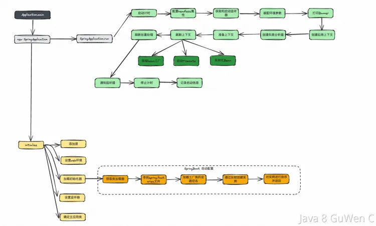

### 9.Spring中@Service 、@Component、@Repository等注解区别是什么？
```
1、@Component：是一个通用的组件声明注解，表示该类是一个Spring组件。它可以用于任何Spring管理的组件。
2、@Service：通常用于标记服务层的组件。虽然它本质上与@Component相同，但这个注解表示该类属于服务层，这有助于区分不同层次的组件。
3、@Repository：用于标记数据访问层的组件，即DAO（Data Access Object）层。这个注解除了将类标识为Spring组件之外，还能让Spring为它提供一些持久化特定的功能，比如异常转换。
4、@Controller：用于标记控制层的组件，特别是在Spring MVC中用于定义控制器类。这个注解通知Spring该类应当作为控制器处理HTTP请求。
```

### 10.spring bean的作用域
```
1、单例（Singleton）：默认作用域。对于每个 Spring IoC 容器，只创建一个 Bean 实例。适用于全局共享的状态。
2、原型（Prototype）：每次请求都会创建一个新的 Bean 实例。适用于所有状态都是非共享的情况。
3、请求（Request）：仅在 Web 应用程序中有效。每个 HTTP 请求都会创建一个新的 Bean 实例。用于请求级别的数据存储和处理。
4、会话（Session）：仅在 Web 应用程序中有效。每个 HTTP 会话都会创建一个新的 Bean 实例。适用于会话级别的数据存储和处理。
5、应用（Application）：仅在 Web 应用程序中有效。在 ServletContext 的生命周期内，只创建一个 Bean 实例。适用于全应用程序级别的共享数据。
6、Websocket：仅在 Web 应用程序中有效。在 Websocket 的生命周期内，只创建一个 Bean 实例。适用于websocket级别的共享数据。
```